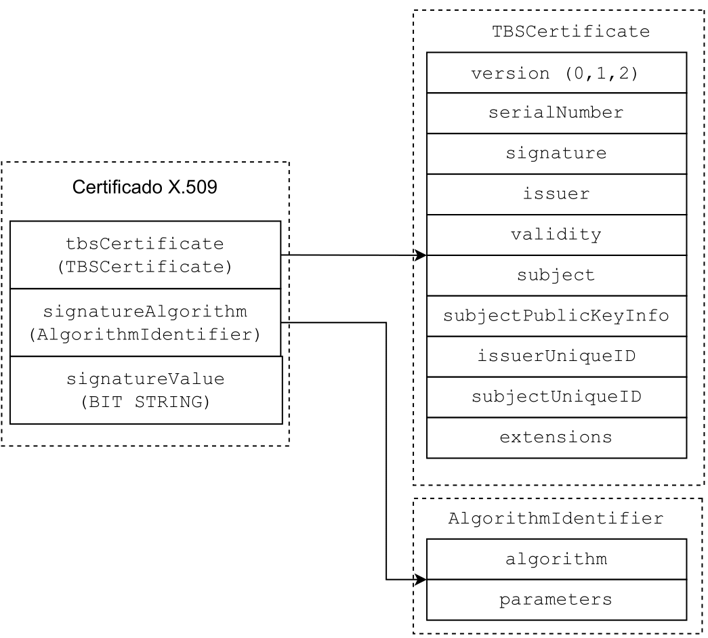

**Sumário**

- [Introdução](#introdução)
- [Gerar um par de chaves](#gerar-um-par-de-chaves)
- [Gerar um certificado digital](#gerar-um-certificado-digital)
  - [Certificado autoassinado](#certificado-autoassinado)
  - [Certificado assinado por outro certificado](#certificado-assinado-por-outro-certificado)
- [Validação "manual" de um certificado digital com OpenSSL](#validação-manual-de-um-certificado-digital-com-openssl)
- [Implementações que utilizam bibliotecas x509 para validação](#implementações-que-utilizam-bibliotecas-x509-para-validação)
  - [Exemplo em Python](#exemplo-em-python)
  - [Exemplo em C++](#exemplo-em-c)
- [Extração do *TBSCertificate*, *BIT STRING* e chave pública sem uso de bibliotecas x.509](#extração-do-tbscertificate-bit-string-e-chave-pública-sem-uso-de-bibliotecas-x509)


## Introdução

Este repositório tem por objetivo demonstrar a geração e validação de certificados digitais (x509) utilizando a biblioteca [OpenSSL](https://www.openssl.org/) e o processo de extração das informações do certificado digital (x.509) sem a utilização de bibliotecas x.509. O processo de validação consiste em fazer a extração do conteúdo assinado (*To be Signed*) (veja [RFC](https://www.rfc-editor.org/rfc/rfc5280#section-4.1.2)) e da assinatura do certificado. Após a extração, é realizado a verificação utilizando o par da chave privada utilizada na assinatura.


## Gerar um par de chaves

Para criar um certificado digital, assinado por uma chave privada específica, inicialmente, é necessário gerar um par de chaves criptográficas conforme os passos descritos a seguir. 

Nos exemplos, será utilizado somente chaves elípticas (EC) com curva P-521. Para fazer os testes utilizando outras curvas (EC) ou outros tamanhos de chaves (RSA), é necessário adaptar os comandos. 

1. Gerar uma chave privada EC com curva P-521 e salvar em memória com nome `c1-priv.pem`

```shell
openssl ecparam -name secp521r1 -genkey -noout -out artefatos/c1-priv.pem
```

2. Gerar a chave pública da chave privada `c1-priv.pem`e salvar em memória com nome `c1-pub.pem`

```shell
openssl ec -in artefatos/c1-priv.pem -pubout -out artefatos/c1-pub.pem
```
ou

1. Gerar uma chave privada RSA de 2048 *bits* e salvar em memória com nome `c1-priv-rsa.pem`

```shell
openssl genrsa -out artefatos/c1-priv-rsa.pem 2048
```

2. Gerar a chave pública da chave privada `c1-priv-rsa.pem`e salvar em memória com nome `c1-pub-rsa.pem`

```shell
openssl rsa -in artefatos/c1-priv-rsa.pem -pubout -out artefatos/c1-pub-rsa.pem
```


> Os nomes dos arquivos de saída devem ser alterados conforme a necessidade. 

## Gerar um certificado digital 

Para gerar um certificado digital é necessário definir as informações de identificação do "proprietário" que serão incorporadas ao certificado, chamadas de *Distinguished Name (DN)* e definir o resumo da mensagem a ser usado (*message digest (MD)*) na requisição. Para isso, nesse exemplo, é preciso alterar as informações contidas no arquivo [pedido.conf](pedido.conf) conforme o exemplo abaixo.

```conf
[ req ]
prompt = no
default_md = sha512
distinguished_name = dn

[ dn ]
C = BR
ST = SC
L = Sao Jose
O = LaSED
OU = IFSC
CN = 1.lased.ifsc.edu.br
```

### Certificado autoassinado

Após definir as informações, para gerar um certificado autoassinado, assinado pela chave privada `c1-priv.pem` utilizando a função *hash* SHA-512, por exemplo, é preciso utilizar o seguinte comando:

> Certificado autoassinado é um certificado que não é assinado por uma *Certificate Authority* (CA)

```shell
openssl req -sha512 -new -x509 -nodes -days 365000 -key c1-priv.pem -out c1.crt -config pedido.conf
```

Para validar se o certificado foi gerado corretamente, pode-se utilizar o seguinte comando:

```shell
openssl verify -CAfile c1.crt c1.crt
```

E para visualizar o conteúdo do certificado, em formato textual, é possível utilizar o comando abaixo.
```shell
openssl x509 -in artefatos/c1.crt -text -noout
```

A saída no terminal, será conforme o exemplo a seguir.

```shell
Certificate:
    Data:
        Version: 1 (0x0)
        Serial Number:
            39:92:b1:2a:13:f6:ee:57:36:9b:9f:6b:f4:26:a5:45:68:5a:44:b9
        Signature Algorithm: ecdsa-with-SHA512
        Issuer: C = BR, ST = SC, L = Sao Jose, O = LaSED, OU = IFSC, CN = 1.lased.ifsc.edu.br
        Validity
            Not Before: Jan  3 16:32:44 2023 GMT
            Not After : May  6 16:32:44 3022 GMT
        Subject: C = BR, ST = SC, L = Sao Jose, O = LaSED, OU = IFSC, CN = 1.lased.ifsc.edu.br
        Subject Public Key Info:
            Public Key Algorithm: id-ecPublicKey
                Public-Key: (521 bit)
                pub:
                    04:01:a7:50:9a:5a:03:4b:95:cf:e8:c4:96:fc:f4:
                    64:16:0d:c9:8c:3a:7e:5b:87:3d:94:f2:91:4e:a1:
                    97:29:aa:4c:27:01:7a:36:9a:18:91:ba:27:58:ab:
                    e5:d5:c5:96:bb:71:17:b4:ac:e0:05:5d:54:64:a7:
                    3b:30:88:3f:c6:2c:5f:01:89:5b:e5:29:db:e7:d5:
                    38:05:49:ac:8f:68:89:96:10:46:9a:c1:0f:d8:d3:
                    69:92:64:45:2b:5e:5b:5a:6f:3c:5f:b8:8e:39:8c:
                    3b:6e:61:03:79:f2:7a:59:f6:00:03:99:42:ca:8a:
                    3c:2e:81:1c:83:f1:c6:b1:b4:cd:36:c1:c4
                ASN1 OID: secp521r1
                NIST CURVE: P-521
    Signature Algorithm: ecdsa-with-SHA512
    Signature Value:
        30:81:88:02:42:00:d3:20:d2:ea:36:3c:fc:71:ad:02:1c:0e:
        00:ee:1c:81:b1:86:a8:79:78:00:8c:81:e2:5f:a6:a1:ec:b3:
        8b:f2:92:bb:66:07:4c:70:04:23:5a:cd:d6:31:2b:8e:09:e4:
        c1:ca:19:d4:69:f1:9b:ef:30:f7:e8:ed:89:83:ed:5c:57:02:
        42:01:d2:c4:cd:b3:19:7b:b0:99:aa:4b:41:f6:e6:d9:6c:91:
        80:b0:8d:dc:27:10:6b:1a:62:5d:f5:74:f4:18:d9:69:f5:81:
        52:e4:88:f3:3b:ea:49:dc:1e:90:f2:a0:b3:b4:dc:9d:2f:ef:
        aa:8d:d1:ec:7a:27:18:53:96:f9:66:07:99
```

### Certificado assinado por outro certificado

Também é possível utilizar um certificado (A) para assinar um novo certificado (B) com a chave utilizada na assinatura do certificado A. Por exemplo, pode-se gerar um novo certificado (c2.crt) assinado pelo certificado autoassinado `c1.crt`. Para isso, é necessário gerar uma nova chave privada, criar um arquivo de pedido (veja [Gerar certificado digital](#gerar-um-certificado-digital)) e fazer uma Solicitação de Assinatura de Certificado (CSR), conforme os passos abaixo:

- Gerar chave privada EC com curva P-521 `c2-priv.pem`:

```shell
openssl ecparam -name secp521r1 -genkey -noout -out artefatos/c2-priv.pem
```

- Gerar a CSR `c2.csr` 
```shell
openssl req -sha512 -key artefatos/c2-priv.pem -new -out artefatos/c2.csr -config pedido2.conf
```

- Assinar a requisição `c2.csr` com a chave privada utilizada no certificado `c1.crt`
  
```shell
openssl x509 -sha512 -req -days 365000 -set_serial 01 -in artefatos/c2.csr -out artefatos/c2-c1.crt -CA artefatos/c1.crt -CAkey artefatos/c1-priv.pem
```
- Para verificar a correspondência dos certificados

```shell
openssl verify -CAfile artefatos/c1.crt artefatos/c2-c1.crt
```


## Validação "manual" de um certificado digital com OpenSSL

Com a verificação do OpenSSL realizada na seção [certificado assinado por outro certificado](#certificado-assinado-por-outro-certificado), após alguns novos certificados, existe a possibilidade de ter toda a cadeia de certificados para conseguir fazer a validação de um novo certificado. 

Conforme a [RFC 5280](https://www.rfc-editor.org/rfc/rfc5280#section-4.1), a estrutura de um certificado digital X.509 é representada por uma sequência (SEQUENCE) de três campos obrigatórios, como ilustrado na imagem abaixo.



> *issuerUniqueID* e *subjectUniqueID* estão presentes somente nas versões v2 (1) e  v3 (2) e *extensions* somente na versão v3 (2) 

Para ser possível fazer a validação desses certificados sem a necessidade de ter toda a cadeia de certificados, é possível realizar a validação "manual" do certificado, conhecendo o algoritmo utilizado na assinatura e fazendo a extração do conteúdo assinado, chamado de *tbsCertificate*, e o valor da assinatura, chamado de *signatureValue*. 

Para esse exemplo, será feito a validação do certificado `c2-c1.crt`, criado na seção anterior. Inicialmente, é necessário analisar o conteúdo do certificado com o *asn1parse* para identificar a posição (*offset*) dos dados a serem extraídos (*tbsCertificate* e *signatureValue*).

```shell
openssl asn1parse -i -in artefatos/c2-c1.crt 
```
Saída no terminal do comando *asn1parse*, para o certificado `c2-c1.crt`:
```shell
    0:d=0  hl=4 l= 580 cons: SEQUENCE          
    4:d=1  hl=4 l= 423 cons:  SEQUENCE          
    8:d=2  hl=2 l=   1 prim:   INTEGER           :01
   11:d=2  hl=2 l=  10 cons:   SEQUENCE          
   13:d=3  hl=2 l=   8 prim:    OBJECT            :ecdsa-with-SHA512
   23:d=2  hl=2 l= 106 cons:   SEQUENCE          
   25:d=3  hl=2 l=  11 cons:    SET               
   27:d=4  hl=2 l=   9 cons:     SEQUENCE          
   29:d=5  hl=2 l=   3 prim:      OBJECT            :countryName
   34:d=5  hl=2 l=   2 prim:      PRINTABLESTRING   :BR
   38:d=3  hl=2 l=  11 cons:    SET               
   40:d=4  hl=2 l=   9 cons:     SEQUENCE          
   42:d=5  hl=2 l=   3 prim:      OBJECT            :stateOrProvinceName
   47:d=5  hl=2 l=   2 prim:      UTF8STRING        :SC
   51:d=3  hl=2 l=  17 cons:    SET               
   53:d=4  hl=2 l=  15 cons:     SEQUENCE          
   55:d=5  hl=2 l=   3 prim:      OBJECT            :localityName
   60:d=5  hl=2 l=   8 prim:      UTF8STRING        :Sao Jose
   70:d=3  hl=2 l=  14 cons:    SET               
   72:d=4  hl=2 l=  12 cons:     SEQUENCE          
   74:d=5  hl=2 l=   3 prim:      OBJECT            :organizationName
   79:d=5  hl=2 l=   5 prim:      UTF8STRING        :LaSED
   86:d=3  hl=2 l=  13 cons:    SET               
   88:d=4  hl=2 l=  11 cons:     SEQUENCE          
   90:d=5  hl=2 l=   3 prim:      OBJECT            :organizationalUnitName
   95:d=5  hl=2 l=   4 prim:      UTF8STRING        :IFSC
  101:d=3  hl=2 l=  28 cons:    SET               
  103:d=4  hl=2 l=  26 cons:     SEQUENCE          
  105:d=5  hl=2 l=   3 prim:      OBJECT            :commonName
  110:d=5  hl=2 l=  19 prim:      UTF8STRING        :1.lased.ifsc.edu.br
  131:d=2  hl=2 l=  32 cons:   SEQUENCE          
  133:d=3  hl=2 l=  13 prim:    UTCTIME           :230103175715Z
  148:d=3  hl=2 l=  15 prim:    GENERALIZEDTIME   :30220506175715Z
  165:d=2  hl=2 l= 106 cons:   SEQUENCE          
  167:d=3  hl=2 l=  11 cons:    SET               
  169:d=4  hl=2 l=   9 cons:     SEQUENCE          
  171:d=5  hl=2 l=   3 prim:      OBJECT            :countryName
  176:d=5  hl=2 l=   2 prim:      PRINTABLESTRING   :BR
  180:d=3  hl=2 l=  11 cons:    SET               
  182:d=4  hl=2 l=   9 cons:     SEQUENCE          
  184:d=5  hl=2 l=   3 prim:      OBJECT            :stateOrProvinceName
  189:d=5  hl=2 l=   2 prim:      UTF8STRING        :SC
  193:d=3  hl=2 l=  17 cons:    SET               
  195:d=4  hl=2 l=  15 cons:     SEQUENCE          
  197:d=5  hl=2 l=   3 prim:      OBJECT            :localityName
  202:d=5  hl=2 l=   8 prim:      UTF8STRING        :Sao Jose
  212:d=3  hl=2 l=  14 cons:    SET               
  214:d=4  hl=2 l=  12 cons:     SEQUENCE          
  216:d=5  hl=2 l=   3 prim:      OBJECT            :organizationName
  221:d=5  hl=2 l=   5 prim:      UTF8STRING        :LaSED
  228:d=3  hl=2 l=  13 cons:    SET               
  230:d=4  hl=2 l=  11 cons:     SEQUENCE          
  232:d=5  hl=2 l=   3 prim:      OBJECT            :organizationalUnitName
  237:d=5  hl=2 l=   4 prim:      UTF8STRING        :IFSC
  243:d=3  hl=2 l=  28 cons:    SET               
  245:d=4  hl=2 l=  26 cons:     SEQUENCE          
  247:d=5  hl=2 l=   3 prim:      OBJECT            :commonName
  252:d=5  hl=2 l=  19 prim:      UTF8STRING        :2.lased.ifsc.edu.br
  273:d=2  hl=3 l= 155 cons:   SEQUENCE          
  276:d=3  hl=2 l=  16 cons:    SEQUENCE          
  278:d=4  hl=2 l=   7 prim:     OBJECT            :id-ecPublicKey
  287:d=4  hl=2 l=   5 prim:     OBJECT            :secp521r1
  294:d=3  hl=3 l= 134 prim:    BIT STRING        
  431:d=1  hl=2 l=  10 cons:  SEQUENCE          
  433:d=2  hl=2 l=   8 prim:   OBJECT            :ecdsa-with-SHA512
  443:d=1  hl=3 l= 138 prim:  BIT STRING 
```

No certificado alvo, os dados de interesse são os contidos no *offset* 4, que representa o início do *TBSCertificate* e o *offset* 443, que representa o *BIT STRING* da assinatura.

> Cada certificado pode ter um valor de *offset* diferente

Para fazer a extração do tbs e da assinatura, nesse exemplo, é necessário utilizar os seguintes comandos:

- Extrair o *TBSCertificate*
```shell
openssl asn1parse -in artefatos/c2-c1.crt -strparse 4 -out c2-c1-tbs.bin -noout
```

- Extrair o *BIT STRING* correspondente a assinatura
```shell
openssl asn1parse -in artefatos/c2-c1.crt -strparse 443 -out c2-c1-sig.bin -noout
```

Após as extrações, é possível fazer a verificação da assinatura do certificado utilizando o par da chave privada usada para assinar o certificado, que nesse caso, foi a `c1-priv.pem`. A verificação é realizada conforme o exemplo abaixo.

```
openssl dgst -sha512 -verify artefatos/c1-pub.pem -signature c2-c1-sig.bin c2-c1-tbs.bin
```

> Caso necessário, pode-se extrair a chave pública de um certificado com o comando #openssl x509 -in certificado.crt -pubkey -noout > certificado.pub

Se for verificado que a assinatura está condizente, deverá retornar no terminal a mensagem `Verified OK`.

## Implementações que utilizam bibliotecas x509 para validação

A seguir será demonstrado duas implementações, uma em *Python*, utilizando a biblioteca *cryptography* e outra em *C++*, utilizando as bibliotecas *openssl/X509.h*, *openssl/x509v3.h* e *openssl/pem.h*, que auxiliam no processo de extração e validação de um certificado digital sem a necessidade de possuir toda a cadeia de certificados.

Para fazer as validações, é necessário ter ao menos dois certificados, um atual e um novo assinado pela chave privada utilizada no atual. Para esses exemplos, será utilizado o certificado `c1.crt` (atual) e o `c2-c1.crt` (novo) gerados na seção [Gerar um certificado digital](#gerar-um-certificado-digital0).
### Exemplo em Python

Neste exemplo, é adotado a mesma ideia apresentada na seção de [validação manual com OpenSSL](#validação-manual-de-um-certificado-digital-com-openssl), onde é feito a extração do *TBSCertificate* e do *BIT STRING* correspondente a assinatura do novo certificado, e realizado a verificação da assinatura utilizando o par da chave privada utilizada no certificado atual.

Para preparar o ambiente para executar o código em *Python*, estando na pasta raíz do repositório, é necessário usar os seguintes comandos:

```shell
cd verificacao-python/
python3 -m venv venv
source venv/bin/activate
pip3 install -r requirements.txt
```

Após preparar o ambiente virtual e ter os certificados, o comando para fazer a verificação do novo certificado é:

```shell
python3 certs.py -d ../artefatos/c1.crt ../artefatos/c2-c1.crt
```

O retorno esperado é apresentado a seguir:

```text
------------------------------
Informações do  ../artefatos/c1.crt
------------------------------
Subject: CN= 1.lased.ifsc.edu.br
Issuer: CN= 1.lased.ifsc.edu.br
Signature Algorithm:  ecdsa-with-SHA512

-------------------------------
Informações do  ../artefatos/c2-c1.crt
------------------------------
Subject: CN= 2.lased.ifsc.edu.br
Issuer: CN= 1.lased.ifsc.edu.br
Signature Algorithm:  ecdsa-with-SHA512
30818602415589117394ea01e3c4ea28ffd955f18a9bb5190cc855f023ff992ba708001cd04f4800562386086049afcd16acb8efbc8c72d195da8bda92f05d02274bb79935e3024174b0eef530cfe682e64048ee25b921821aa2bbeab711da992358a37cfb0c679cd4cf256be094bde866cba6806f21c9715b17e33ad8619698e5048fc9b8291b6290

Assinatura válida
```
### Exemplo em C++

Nessa demonstração, não foi necessário utilizar explicitamente o *TBSCertificate* e o *BIT STRING* correspondente a assinatura na verificação, pelo fato da biblioteca fazer a verificação utilizando-os implicitamente.

Para fazer a compilação da demonstração, estando na pasta raíz do repositório, é necessário seguir os seguintes passos:

```shell
cd verificacao-C
g++ main.cpp -o main -lcrypto
```

Se ocorrer tudo certo na compilação, pode-se usar o comando abaixo para executar o arquivo binário `main` gerado.

```shell
./main ../artefatos/c1.crt ../artefatos/c2-c1.crt
```

Caso queria ver as informações extraídas dos certificados, é possível adicionar a flag `-d` após os certificados. O retorno esperado é como apresentado abaixo

```text
---------------------------------------------
Informações do Certificado: ../artefatos/c1.crt
---------------------------------------------
Subject: C=BR, ST=SC, L=Sao Jose, O=LaSED, OU=IFSC, CN=1.lased.ifsc.edu.br
Issuer: C=BR, ST=SC, L=Sao Jose, O=LaSED, OU=IFSC, CN=1.lased.ifsc.edu.br
Public-Key: (521 bit)
pub:
    04:01:a7:50:9a:5a:03:4b:95:cf:e8:c4:96:fc:f4:
    64:16:0d:c9:8c:3a:7e:5b:87:3d:94:f2:91:4e:a1:
    97:29:aa:4c:27:01:7a:36:9a:18:91:ba:27:58:ab:
    e5:d5:c5:96:bb:71:17:b4:ac:e0:05:5d:54:64:a7:
    3b:30:88:3f:c6:2c:5f:01:89:5b:e5:29:db:e7:d5:
    38:05:49:ac:8f:68:89:96:10:46:9a:c1:0f:d8:d3:
    69:92:64:45:2b:5e:5b:5a:6f:3c:5f:b8:8e:39:8c:
    3b:6e:61:03:79:f2:7a:59:f6:00:03:99:42:ca:8a:
    3c:2e:81:1c:83:f1:c6:b1:b4:cd:36:c1:c4
ASN1 OID: secp521r1
NIST CURVE: P-521
    Signature Algorithm: ecdsa-with-SHA512
    Signature Value:
        30:81:88:02:42:00:d3:20:d2:ea:36:3c:fc:71:ad:02:1c:0e:
        00:ee:1c:81:b1:86:a8:79:78:00:8c:81:e2:5f:a6:a1:ec:b3:
        8b:f2:92:bb:66:07:4c:70:04:23:5a:cd:d6:31:2b:8e:09:e4:
        c1:ca:19:d4:69:f1:9b:ef:30:f7:e8:ed:89:83:ed:5c:57:02:
        42:01:d2:c4:cd:b3:19:7b:b0:99:aa:4b:41:f6:e6:d9:6c:91:
        80:b0:8d:dc:27:10:6b:1a:62:5d:f5:74:f4:18:d9:69:f5:81:
        52:e4:88:f3:3b:ea:49:dc:1e:90:f2:a0:b3:b4:dc:9d:2f:ef:
        aa:8d:d1:ec:7a:27:18:53:96:f9:66:07:99

---------------------------------------------
Informações do Certificado: ../artefatos/c2-c1.crt
---------------------------------------------
Subject: C=BR, ST=SC, L=Sao Jose, O=LaSED, OU=IFSC, CN=2.lased.ifsc.edu.br
Issuer: C=BR, ST=SC, L=Sao Jose, O=LaSED, OU=IFSC, CN=1.lased.ifsc.edu.br
Public-Key: (521 bit)
pub:
    04:00:fb:4a:d8:52:33:0e:ed:98:73:45:32:1b:5a:
    2c:a6:71:51:5d:90:75:46:19:d0:22:fc:d2:fe:2d:
    91:0e:52:54:4b:40:bf:5d:e3:85:62:60:1c:e3:6d:
    e2:8c:84:24:05:b2:43:76:63:a0:01:c3:d2:cb:ac:
    47:83:9b:8e:b2:a7:fa:00:04:1d:1d:3c:31:24:b1:
    5c:00:1a:19:a3:3d:69:46:fa:3b:c1:5a:55:2c:cb:
    6e:17:3e:66:d7:9f:4f:f8:f4:e4:43:38:c6:20:e3:
    f9:7c:39:17:0b:45:b8:55:6a:d3:1e:3b:a4:5c:da:
    b1:a2:f7:12:b9:1a:f5:c9:70:bf:ee:97:15
ASN1 OID: secp521r1
NIST CURVE: P-521
    Signature Algorithm: ecdsa-with-SHA512
    Signature Value:
        30:81:86:02:41:55:89:11:73:94:ea:01:e3:c4:ea:28:ff:d9:
        55:f1:8a:9b:b5:19:0c:c8:55:f0:23:ff:99:2b:a7:08:00:1c:
        d0:4f:48:00:56:23:86:08:60:49:af:cd:16:ac:b8:ef:bc:8c:
        72:d1:95:da:8b:da:92:f0:5d:02:27:4b:b7:99:35:e3:02:41:
        74:b0:ee:f5:30:cf:e6:82:e6:40:48:ee:25:b9:21:82:1a:a2:
        bb:ea:b7:11:da:99:23:58:a3:7c:fb:0c:67:9c:d4:cf:25:6b:
        e0:94:bd:e8:66:cb:a6:80:6f:21:c9:71:5b:17:e3:3a:d8:61:
        96:98:e5:04:8f:c9:b8:29:1b:62:90

---------------------------------------------
Assinatura válida!
---------------------------------------------
```

## Extração do *TBSCertificate*, *BIT STRING* e chave pública sem uso de bibliotecas x.509

Para cenários onde não se pode utilizar bibliotecas externas para realizar operações em certificados digitais, como as apresentadas na seção [Implementações que utilizam bibliotecas x509 para validação](#implementações-que-utilizam-bibliotecas-x509-para-validação), é possível fazer a extração das informações (*TBSCertificate* e *BIT STRING*) a partir do certificado codificado no formato ASN.1 distinguished encoding rules (DER) e utilizá-las para fazer a validação da assinatura.

Para demonstrar uma forma de fazer essas extrações do certificado digital (formato DER) sem o uso de bibliotecas x.509, foi implementado dois códigos em C++, o [tbs-sign-extractor.cpp](/verificacao-sem-lib-x509/tbs_sign_extractor.cpp), com a finalidade de fazer a extração do *TBSCertificate* e do *BIT STRING* correspondente a assinatura, e o [pub_key_extractor.cpp](/verificacao-sem-lib-x509/pub_key_extractor.cpp), responsável por extrair a chave pública. 

Para a execução correta desses códigos, é necessário ter ao menos dois certificados no formato DER, onde um certificado deve ser assinado pelo par da chave pública contida no outro certificado. Para os exemplos, será utilizado o certificado [c2-c1.der](/artefatos-testes/c2-c1.der) e o [c3-c2.der](/artefatos-testes/c3-c2.der) assinado pelo par da chave pública contida no `c2-c1.der`.

> Para converter um certificado do formato PEM para DER, é possível utilizar o comando #openssl x509 -outform der -in certificate.pem -out certificate.der

Estando na pasta [verificacao-sem-lib-x509](/verificacao-sem-lib-x509/), para fazer a compilação dos códigos C++, é necessário utilizar os seguintes comandos:

```shell
g++ tbs_sign_extractor.cpp -o tbs_sign_extractor
g++ pub_key_extractor.cpp -o pub_key_extractor
```

Após a compilação, será gerado os binários executáveis `tbs_sign_extractor` e `pub_key_extractor`, os quais serão utilizados para fazer as extrações. Inicialmente, será feito a extração do *TBSCertificate* e do *BIT STRING* do certificado `c3-c2.der`, e após será realizado a extração da chave pública do certificado `c2-c1.der` para fazer a verificação da assinatura do certificado `c3-c2.der`.

Para a primeira extração, é necessário utilizar o comando:

```shell
./tbs_sign_extractor ../artefatos/c3-c2.der ../artefatos/c3-c2.tbs ../artefatos/c3-c2.sign ec-521 sha-512
```
onde:

* c3-c2.der: certificado codificado no formato DER que se deseja extrair as informações (tbs e assinatura);
* c3-c2.tbs: nome do arquivo binário que irá conter o conteúdo do *TBSCertificate*;
* c3-c2.sign: nome do arquivo binário que irá conter o conteúdo da assinatura (*BIT STRING*);
* ec-521: algoritmo da chave pública contida no certificado, podendo ser: **ec-256**, **ec-384**, **ec-521** ou **rsa**;
* sha-512: algoritmo utilizado na assinatura do certificado, podendo ser: **sha-256**, **sha-384**, **sha-512** ou **rsa**.

Após a extração do TBS e da assinatura do certificado `c3-c2.der`, é necessário fazer a extração da chave pública do certificado `c2-c1.der` com o seguinte comando:

```shell
./pub_key_extractor ../artefatos/c2-c1.der ../artefatos/c2-pub.der ec-521
```
onde: 

* c2-c1.der: certificado codificado no formato DER que se deseja extrair a chave pública;
* c2-pub.der: nome do arquivo binário que irá conter a chave pública codificada no formato DER;
* ec-521: algoritmo da chave pública contida no certificado, podendo ser: **ec-256**, **ec-384**, **ec-521** ou **rsa**.

Após realizar todas as extrações (tbs, assinatura e chave pública), para fazer a verificação utilizando o OpenSSL, é necessário converter a chave pública do formato DER para PEM utilizando o comando:

```shell
openssl ec -pubin -in ../artefatos/c2-pub.der -inform DER -outform PEM -out ../artefatos/c2-der-pub.pem
```

Tendo a chave pública no formato PEM, pode-se utilizar o comando OpenSSL abaixo para verificar se o certificado `c3-c2.der` foi assinado pelo par da chave pública contida no certificado `c2-c1.der`. Após a execução do comando, deverá retornar no terminal a mensagem `Verified OK`.

```shell
openssl dgst -sha512 -verify ../artefatos/c2-der-pub.pem -signature ../artefatos/c3-c2.sign ../artefatos/c3-c2.tbs
```

O código [tbs-sign-extractor.cpp](/verificacao-sem-lib-x509/tbs_sign_extractor.cpp) é capaz de fazer a extração do *TBSCertificate* e da assinatura dos certificados com os seguintes algoritmos:

| Chave pública      | SHA-256 | SHA-384 | SHA-512 |
|--------------------|---------|---------|---------|
| EC com curva P-256 | √       | √       | √       |
| EC com curva P-384 | √       | √       | √       |
| EC com curva P-521 | √       | √       | √       |
| RSA 2048           | x       | x       | x       |
| RSA 4096           | x       | x       | x       |

Assim como, o [pub_key_extractor.cpp](/verificacao-sem-lib-x509/pub_key_extractor.cpp) é capaz de fazer a extração da chave pública dos certificados com as mesmas características acima.


> Para ser possível fazer a extração das informações dos certificados que possuem chaves RSA, é necessário fazer uma análise no arquivo DER para identificar a suas características e fazer a adaptação no código.


